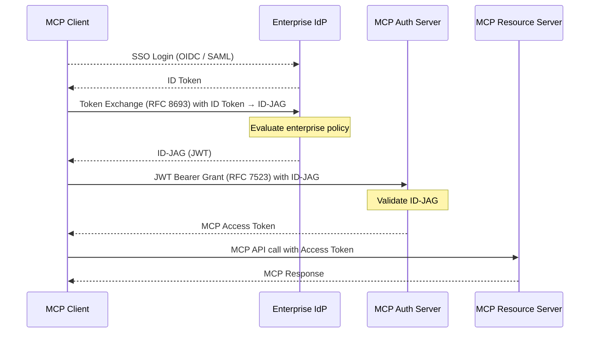

# Implement Enterprise-Managed Authorization on MCP Server

Add the **Enterprise-Managed Authorization** extension (`io.modelcontextprotocol/enterprise-managed-authorization`) to your MCP server, enabling seamless access for enterprise employees already signed into their organization's Identity Provider (IdP) — no separate MCP login required.

**Extension identifier:** `io.modelcontextprotocol/enterprise-managed-authorization`
**Status:** Draft
**Spec:** https://github.com/modelcontextprotocol/ext-auth/blob/main/specification/draft/enterprise-managed-authorization.mdx
**Based on:** [Identity Assertion Authorization Grant](https://datatracker.ietf.org/doc/draft-ietf-oauth-identity-assertion-authz-grant/)

## When to Use This Extension

Use enterprise-managed authorization when:
- Your organization uses an **enterprise IdP** (Azure AD / Entra ID, Okta, Google Workspace, Ping Identity, etc.)
- Employees are already **signed into their MCP client** via SSO
- You want **zero additional login prompts** for MCP access
- Enterprise admins need **centralized policy control** over which users can access which MCP servers with which scopes
- You need **auditability** of AI agent access through existing enterprise IAM

## How It Works

Instead of sending users through a separate OAuth consent screen per MCP server, the enterprise IdP acts as a trusted intermediary:

1. User logs into the MCP Client via enterprise SSO (OpenID Connect or SAML) → **ID Token** issued
2. MCP Client exchanges the ID Token with the IdP for an **Identity Assertion JWT Authorization Grant (ID-JAG)** — targeting the specific MCP server
3. MCP Client presents the ID-JAG to the **MCP Authorization Server** as a JWT Bearer Grant (RFC 7523)
4. MCP Authorization Server validates the ID-JAG and issues an **MCP access token**
5. Client uses the access token to call the MCP server



## Roles and Terminology

| Term | Meaning |
|------|---------|
| **Identity Provider (IdP)** | Enterprise SSO system (Azure AD, Okta, etc.) |
| **Identity Assertion** | ID Token (OIDC) or SAML Assertion from the IdP |
| **ID-JAG** | Identity Assertion JWT Authorization Grant — a JWT signed by the IdP certifying that a specific user may use a specific MCP server |
| **Authorization Server (MAS)** | The OAuth server that issues MCP access tokens |
| **Resource Server (MRS)** | Your MCP Server |
| **Subject Token** | The user's ID Token or SAML assertion presented during Token Exchange |

## Step 1: Register the MCP Client with the Enterprise IdP

The MCP Client must be **pre-registered** with the enterprise IdP for SSO. During registration, configure:

- **Grant type**: `authorization_code` (for SSO), `token-exchange` (RFC 8693) for ID-JAG issuance
- **Scopes**: `openid` (for OIDC SSO)
- **Redirect URIs**: Client's SSO callback URL
- **Audience mapping**: Map the client's `client_id` at the IdP to the client's `client_id` at the MCP Authorization Server (this allows the IdP to include the correct `client_id` in the ID-JAG)

This registration **happens outside the protocol** — typically by enterprise admins configuring the IdP.

## Step 2: MCP Client — SSO Login and ID Token Acquisition

The MCP Client logs the user in via enterprise SSO and obtains an ID Token:

```typescript
// Example: OIDC login with Entra ID / Okta
// (client-side: handled by MSAL, oidc-client-ts, or similar library)
// After login, the client holds:
const idToken = "<OIDC ID Token JWT from the IdP>";
```

## Step 3: MCP Client — Token Exchange (RFC 8693) for ID-JAG

The client exchanges the ID Token with the IdP's token endpoint to obtain an ID-JAG targeting the specific MCP server:

```typescript
const tokenExchangeResponse = await fetch(`${IDP_TOKEN_ENDPOINT}`, {
  method: "POST",
  headers: { "Content-Type": "application/x-www-form-urlencoded" },
  body: new URLSearchParams({
    grant_type: "urn:ietf:params:oauth:grant-type:token-exchange",
    requested_token_type: "urn:ietf:params:oauth:token-type:id-jag",
    audience: MCP_AUTHORIZATION_SERVER_ISSUER,       // e.g., "https://auth.mcp.example.com/"
    resource: MCP_SERVER_RESOURCE_IDENTIFIER,         // e.g., "https://mcp.example.com/"
    scope: "mcp:read mcp:write",                      // optional, requested scopes
    subject_token: idToken,
    subject_token_type: "urn:ietf:params:oauth:token-type:id_token",
    client_id: CLIENT_ID,
    client_secret: CLIENT_SECRET,                     // if client auth required
  }),
});

const { access_token: idJag, issued_token_type } = await tokenExchangeResponse.json();
// issued_token_type must be "urn:ietf:params:oauth:token-type:id-jag"
```

**IdP Token Exchange Request Parameters:**

| Parameter | Required | Description |
|-----------|----------|-------------|
| `grant_type` | REQUIRED | `urn:ietf:params:oauth:grant-type:token-exchange` |
| `requested_token_type` | REQUIRED | `urn:ietf:params:oauth:token-type:id-jag` |
| `audience` | REQUIRED | Issuer URL of the MCP Authorization Server |
| `resource` | REQUIRED | RFC 9728 Resource Identifier of the MCP server |
| `subject_token` | REQUIRED | The user's ID Token (or SAML assertion) |
| `subject_token_type` | REQUIRED | `urn:ietf:params:oauth:token-type:id_token` (OIDC) or `urn:ietf:params:oauth:token-type:saml2` (SAML) |
| `scope` | OPTIONAL | Space-separated list of requested scopes at the MCP server |

## Step 4: MCP Client — Access Token Request (RFC 7523 JWT Bearer)

Use the ID-JAG as a JWT Bearer Grant to request an access token from the MCP Authorization Server:

```typescript
const accessTokenResponse = await fetch(`${MCP_AUTHORIZATION_SERVER_ISSUER}/token`, {
  method: "POST",
  headers: {
    "Content-Type": "application/x-www-form-urlencoded",
    "Authorization": `Basic ${Buffer.from(`${CLIENT_ID}:${CLIENT_SECRET}`).toString("base64")}`,
  },
  body: new URLSearchParams({
    grant_type: "urn:ietf:params:oauth:grant-type:jwt-bearer",
    assertion: idJag,             // The ID-JAG from the previous step
  }),
});

const { access_token, expires_in, token_type } = await accessTokenResponse.json();
```

## Step 5: MCP Authorization Server — Validate ID-JAG

Your MCP Authorization Server must validate incoming ID-JAG JWTs before issuing access tokens.

**The ID-JAG is a JWT with `typ: oauth-id-jag+jwt` signed by the enterprise IdP:**

```typescript
import { createRemoteJWKSet, jwtVerify } from "jose";

async function validateIdJag(assertion: string, clientId: string): Promise<JWTPayload> {
  // Fetch IdP JWKS (cache in production)
  const idpJwks = createRemoteJWKSet(new URL(`${IDP_ISSUER}/.well-known/jwks.json`));

  const { payload } = await jwtVerify(assertion, idpJwks, {
    issuer: IDP_ISSUER,                              // must match IdP issuer
    audience: MCP_AUTHORIZATION_SERVER_ISSUER,       // MAS must be the audience
    typ: "oauth-id-jag+jwt",                         // validate typ header claim
  });

  // Validate client_id matches the authenticated client
  if (payload.client_id !== clientId) {
    throw new Error("client_id mismatch between ID-JAG and request");
  }

  // Validate resource
  if (payload.resource !== MCP_SERVER_RESOURCE_IDENTIFIER) {
    throw new Error("resource mismatch in ID-JAG");
  }

  return payload;
}
```

**Required ID-JAG Claims:**

| Claim | Required | Description |
|-------|----------|-------------|
| `iss` | REQUIRED | IdP issuer URL |
| `sub` | REQUIRED | Subject identifier (user ID) at the MCP server |
| `aud` | REQUIRED | Issuer URL of the MCP Authorization Server |
| `resource` | REQUIRED | RFC 9728 Resource Identifier of the MCP server |
| `client_id` | REQUIRED | The MCP Client's `client_id` at the Authorization Server |
| `jti` | REQUIRED | Unique ID for replay protection |
| `exp` | REQUIRED | Expiration time (Unix timestamp) |
| `iat` | REQUIRED | Issued-at time (Unix timestamp) |
| `scope` | OPTIONAL | Space-separated scopes associated with the token |

The `typ` header claim of the JWT **MUST** be `oauth-id-jag+jwt`.

## Step 6: MCP Server — Validate Access Tokens

Validate incoming access tokens from MCP clients (same as any bearer token validation):

```typescript
import { createRemoteJWKSet, jwtVerify } from "jose";

const masJwks = createRemoteJWKSet(new URL(`${MCP_AUTHORIZATION_SERVER_ISSUER}/.well-known/jwks.json`));

async function validateMcpToken(authorizationHeader: string): Promise<void> {
  const token = authorizationHeader.replace("Bearer ", "");
  const { payload } = await jwtVerify(token, masJwks, {
    issuer: MCP_AUTHORIZATION_SERVER_ISSUER,
    audience: MCP_SERVER_RESOURCE_IDENTIFIER,
  });

  // Check required scopes
  const scopes = (payload.scope as string ?? "").split(" ");
  if (!scopes.includes("mcp:read")) {
    throw new Error("Insufficient scopes");
  }
}
```

## Protected Resource Metadata

Expose the standard protected resource metadata endpoint (RFC 9728):

```typescript
app.get("/.well-known/oauth-protected-resource", (req, res) => {
  res.json({
    resource: MCP_SERVER_RESOURCE_IDENTIFIER,
    authorization_servers: [MCP_AUTHORIZATION_SERVER_ISSUER],
    bearer_methods_supported: ["header"],
    scopes_supported: ["mcp:read", "mcp:write"],
  });
});
```

## Enterprise Admin Configuration

Enterprise admins need to configure the IdP policy for the token exchange:

1. **Register the MCP Client** — The MCP client app must be registered in the IdP
2. **Configure token exchange policy** — Define which users/groups can obtain ID-JAGs for which MCP servers and scopes
3. **Map client identifiers** — The IdP must know the MCP client's `client_id` at the MCP Authorization Server (to include in the ID-JAG `client_id` claim)
4. **Optional: Multi-factor authentication** — IdP can require step-up MFA based on sensitivity of MCP server access

## Security Considerations

- **Client pre-registration** — In most enterprise deployments, the IdP only allows token exchange for pre-registered clients; the MCP client must be registered with the enterprise IdP
- **Replay protection** — The MCP Authorization Server must validate `jti` uniqueness to prevent replay attacks
- **Short-lived ID-JAG** — ID-JAGs should have short expiry (< 5 minutes); `expires_in: 300` is typical
- **Audience binding** — Validate that the ID-JAG `aud` matches your Authorization Server's issuer URL
- **Client binding** — Validate that the `client_id` claim in the ID-JAG matches the authenticated client
- **Scope limitation** — Scopes in the access token should not exceed the scopes in the ID-JAG

## Dependencies

```bash
npm install jose        # JWT validation and creation
npm install cors        # CORS for HTTP transport
```

## Environment Variables

```env
# MCP Server
MCP_SERVER_RESOURCE_IDENTIFIER=https://mcp.example.com/
MCP_AUTHORIZATION_SERVER_ISSUER=https://auth.mcp.example.com/

# Enterprise IdP
IDP_ISSUER=https://login.microsoftonline.com/{tenant}/v2.0    # Entra ID example
IDP_TOKEN_ENDPOINT=https://login.microsoftonline.com/{tenant}/oauth2/v2.0/token

# MCP Client credentials (registered at both IdP and MAS)
CLIENT_ID=your-mcp-client-id
CLIENT_SECRET=your-client-secret
```

## Testing the Full Flow

1. Log in the user via enterprise SSO → verify ID Token received
2. Perform token exchange with the IdP → verify ID-JAG returned with `issued_token_type: urn:ietf:params:oauth:token-type:id-jag`
3. Inspect the ID-JAG JWT:
   - `typ` header = `oauth-id-jag+jwt`
   - `aud` = your MAS issuer URL
   - `resource` = your MCP server identifier
   - `client_id` = your client's ID at the MAS
4. Present ID-JAG to MAS → verify MCP access token returned
5. Call MCP server with access token → verify successful response
6. Test policy enforcement: have a user from a group that shouldn't have access attempt the flow → verify `400 invalid_grant` from IdP
